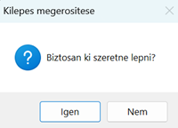
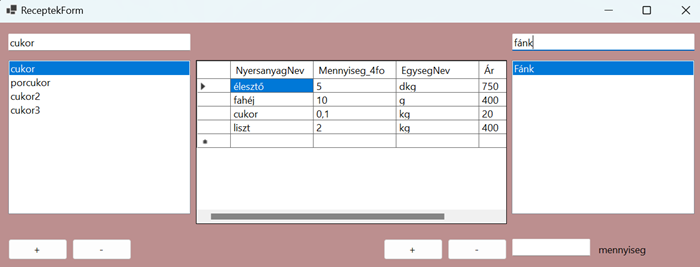
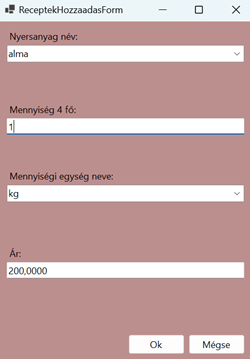
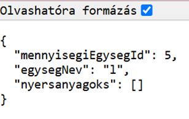
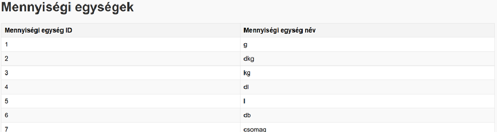
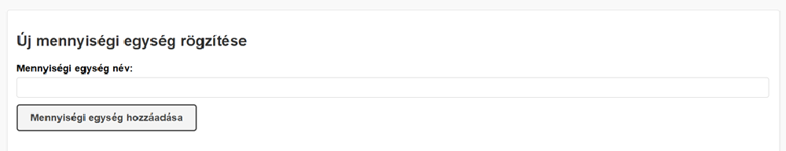
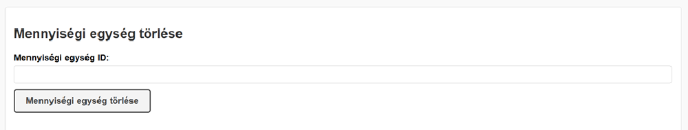
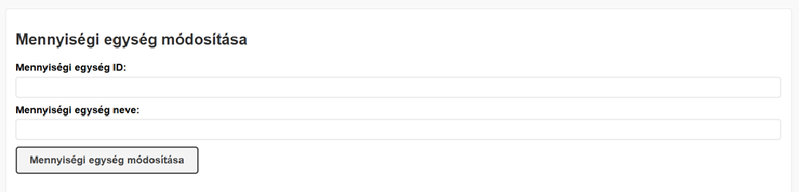
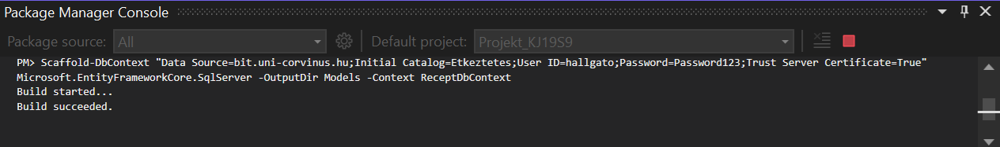

# Pontozólap
### Adatbázis: nem saját (Étkeztetés)
### Windows Forms Application
##### User Interface
-   `1x2p`  Az alkalmazásból a kilépés csak megerősítő kérdés után lehetséges.

-   `2x1p`  Többablakos alkalmazás legalább két felugró ablakkal. Form1: ReceptekForm megnyitására szolgál. ReceptekForm: Recepteket kezelhetünk rajta: nyersanyagok, receptek, hozzávalók megtekintése; Emellett új hozzávalót adhatunk hozzá egy recepthez (felugró ablak nélkül). ReceptekHozzaadasForm: Új hozzávaló hozzáadására szolgál (felugró ablak).
-   `1x2p`  Anchorok alkalmazása: az alkalmazás egészében meg van oldva, hogy az ablak átméretezésekor ki legyen használva a rendelkezésre álló terület.
##### Tábla adatainak megjelenítése  `ListBox`-ban.
-   `1x2p`  Adatok megjelenítése: a nyersanyagok és a fogások jelennek meg a listbox-okban (NyersanyagListazas, FogasListazas metódusok).
-   `2x2p`  Ha az adatok tetszőleges módszerrel, pl.  `TextBox`-on keresztül szűrhetőek.

-   `1x2p`  Ha a listbox adatforrása saját osztály (nyersanyagok, fogasok).
##### Tábla adatainak megjelenítése  `DataGridView`-ban
-   `1x2p`  Adatok megjelenítése: Hozzávalók megjelenítése DataGridView-ban (HozzavaloListazas).
-   `1x2p`  Ha a tábla adatforrása saját osztály (Hozzavalo).
##### Adatkötés  `BindingSource`  -on keresztül
-   `1x2p`  Működő  `BindingSource`: nyersanyagokBindingSource, fogasokBindingSource, mennyisegiEgysegekBindingSource
-   `1x1p`  Egy `BindingSource`-ra egy gyűjemény megjelenítésére alkalmas vezérlő (pl.: ListÍBox, ComboBox, DataGridVIew) mellett más adatkötött vezérlő is van kötve, mint TextBox, ComboBox idegen kulcs értékének beállítására, stb: ReceptekHozzaadasForm-ban ha kiválasztunk egy nyersanyagot, akkor a mennyiségi egység combobox-ban és az ár textbox-ban a hozzá tartozó érték jelenik meg.
##### Új rekord rögzítése
-   `2x2p`  Master-detail reláció detail táblájába ÉS/VAGY több-a-több kapcsolatban álló táblák kapcsolótáblájába: Receptek tábla a Fogasok és Nyersanyagok táblákhoz kapcsolódik (FogasId és NyersanyagId idegen kulcsokkal).
-   `1x2p`  Ha csak az idegen kulcsok vannak felvéve: Az új rekord rögzítése során mindkét idegen kulcs (NyersanyagId és FogasId) beállításra kerül.
-   `1x1p`  Ha legalább egy nem kulcs mező is fel van véve: A kódban a NyersanyagNev, Mennyiseg4fo, EgysegNev, Egysegar mező is fel van véve a rekordhoz, ami egy nem kulcs mező.
-   `1x2p`  Ellenőrzéshez kötött adatfelvitel: A kódban az adatbevitelt ellenőrzöm: ha nincs kiválasztva nyersanyag vagy érvénytelen mennyiséget adtak meg, akkor hibaüzenet jelenik meg.
-   `1x2p`  Felugró ablakon keresztül történik  _Ok_  és  _Mégse_  gombbal. A `HozzavaloHozzaadasForm` ablakon keresztül történik az adatbevitel.

-   `1x2p`  Ha az űrlap legördülő dobozon vagy listán keresztül beállítható idegen kulcsot is tartalmaz: A kódban pl a comboBox1 a Nyersanyagok táblát listázza, és ezen keresztül beállítható a NyersanyagId idegen kulcs.
##### Rekord törlése
-   `1x2p`  Sikeres törlés.
-   `1x2p`  Megerősítéshez kötött törlés.
### ASP .NET
##### API végpontok
- `1x2p`  `program.cs` beállítása `wwwroot` mappában tárolt statikus tartalmak megosztására: A program.cs fájlban meg van hívva ez a kettő metódus: app.UseDefaultFiles(); app.UseStaticFiles();
- `1x3p`Teljes SQL tábla adatainak kiszolgálása. Az API `/api/receptek` végpontja a teljes tábla adatait visszaadja. A GET metódus ([HttpGet]) visszaadja a MennyisegiEgysegek tábla összes rekordját.
- `1x2p` SQL tábla egy választható rekordjának szolgáltatása API végponton keresztül. Az API `/api/receptek/{id}` végpontja egy adott rekordot szolgáltat ID alapján.

- `1x3p` SQL tábla egy választható rekordjának törlése. Az API `/api/receptek/{id}` végpontja DELETE metódussal képes rekordot törölni.
- `1x5p` Új rekord felvétele `HttpPost` metóduson keresztül SQL táblába. A `/api/receptek` POST metódusa új rekordot ad hozzá az SQL táblához.
- `1x3p` Rekord módosítása `HttpPost` metóduson keresztül SQL táblában. A `/api/receptek/{id}` PUT metódusa módosítja az adott rekordot.
##### Javascript
- `1x5p` DOM feltöltése javascripttel. A táblázat JavaScript segítségével dinamikusan töltődik fel az API adataival (`fetch` hívás).
##### Weboldal
- `1x1p` A weboldalnak van egy értelmezhető struktúrája. A HTML dokumentum megfelelő szerkezettel, űrlapokkal és táblázattal rendelkezik a funkcionalitás kezeléséhez.

- `1x1p` A weboldal dinamikus tartalommal tölthető fel adatbázison keresztül. A fetch API használatával a GET végpontból betöltött adatok jelennek meg a HTML táblázatban.
- `1x1p` A weboldal használ legalább 20 sor értelmes css-t.
- `1x1p` A weboldal javascriptet használ API végpont által szolgáltatott adatok betöltésére, hozott anyagként. A fetch API-val betöltött adatokkal működik a dinamikus tartalom frissítése.
- `1x1p` A weboldal javascriptje más funkciót is ellát, mint az adatok betöltése (például rekordok hozzáadása, törlése és módosítása). A POST, DELETE, és PUT funkciók is implementálva vannak a JavaScriptben.
##### Egyéb
- `2x1p` Scaffold-DbContext használata: Scaffold-DbContext "Data Source=bit.uni-corvinus.hu;Initial Catalog=Etkeztetes;User ID=hallgato;Password=Password123;Trust Server Certificate=True" Microsoft.EntityFrameworkCore.SqlServer -OutputDir Models -Context ReceptDbContext

**Windows Forms Application rész:** 28/28
**ASP .NET rész:** 38/38
**Egyéb (scaffold):** 2/2
**Összesen:** 68/68
